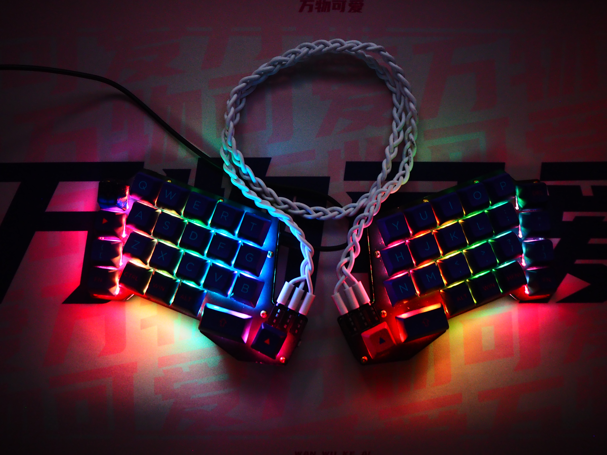
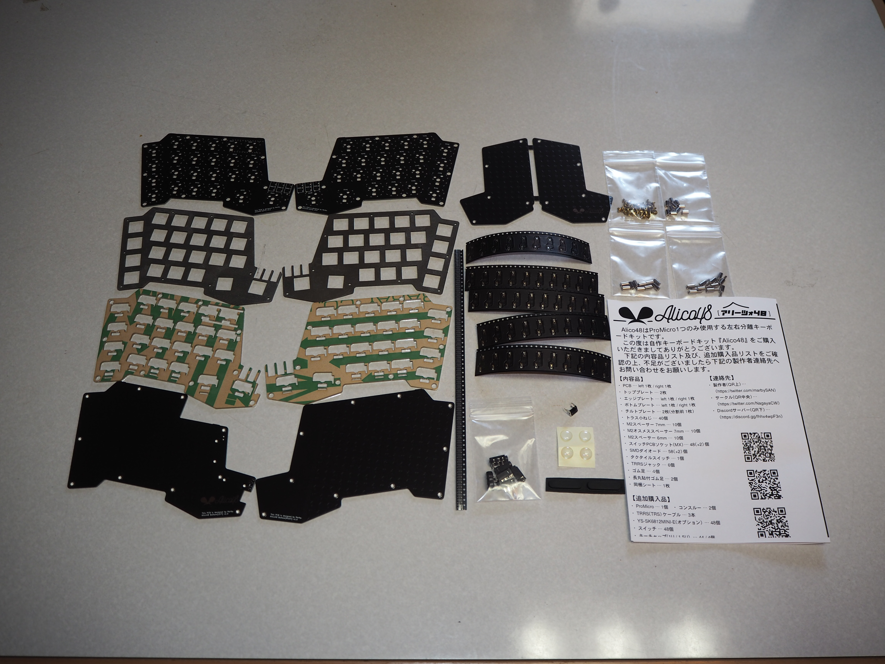
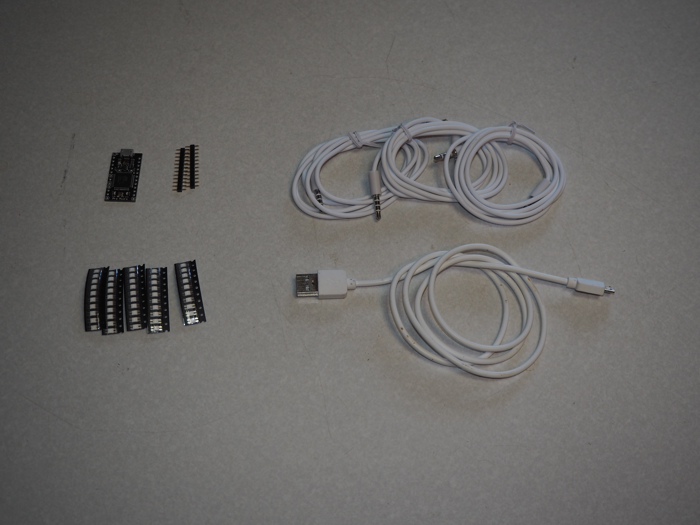
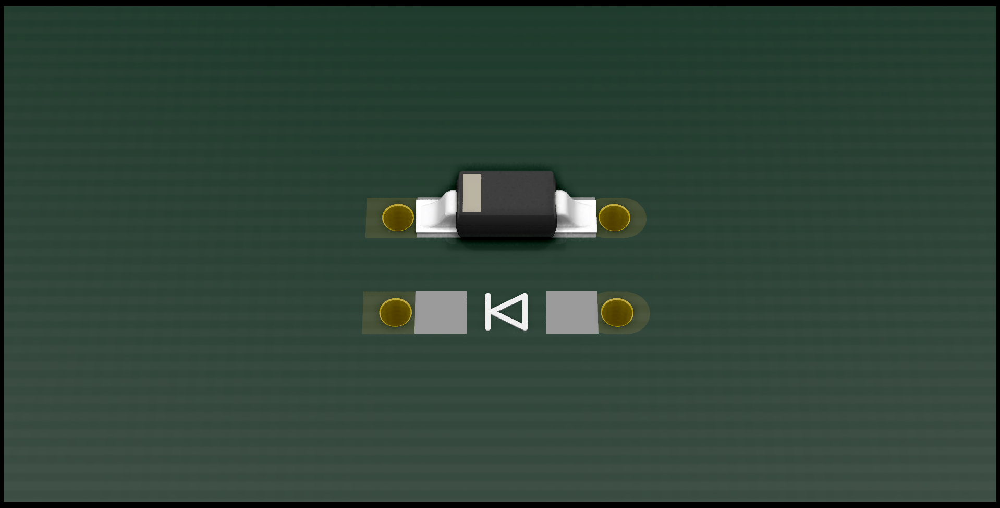

# Alico48 ビルドガイド #
  
### 目次 {ignore=true} ###
<!-- @import "[TOC]" {cmd="toc" depthFrom=1 depthTo=6 orderedList=false} -->

<!-- code_chunk_output -->

- [Alico48 ビルドガイド #](#alico48-ビルドガイド)
    - [目次 {ignore=true} ###](#目次-ignoretrue)
    - [はじめに ###](#はじめに)
    - [全体の流れ ###](#全体の流れ)
    - [ファームウェアについて注意 ###](#ファームウェアについて注意)
  - [01. 内容品及び追加購入品が数通りあることを確認する ##](#01-内容品及び追加購入品が数通りあることを確認する)
    - [内容品 ###](#内容品)
    - [追加購入品 ###](#追加購入品)
  - [02. PCBに部品を実装する ##](#02-pcbに部品を実装する)
    - [02.01. SMDダイオードをはんだ付けする ##](#0201-smdダイオードをはんだ付けする)
    - [02.02. スイッチ用PCBソケット(MX)をはんだ付けする ###](#0202-スイッチ用pcbソケットmxをはんだ付けする)
    - [02.03. タクタイルスイッチをはんだ付けする ###](#0203-タクタイルスイッチをはんだ付けする)
    - [02.04. TRRSジャックをはんだ付けする ###](#0204-trrsジャックをはんだ付けする)
    - [02.05. YS-SK6812MINI-Eをはんだ付けする(オプション) ###](#0205-ys-sk6812mini-eをはんだ付けするオプション)
    - [02.06. ProMicroとコンスルーをはんだ付けする ###](#0206-promicroとコンスルーをはんだ付けする)
    - [02.07. はんだごてのコンセントを抜く ###](#0207-はんだごてのコンセントを抜く)
  - [03. ProMicroにファームウェアを書き込み、PCBの動作チェックを行う ###](#03-promicroにファームウェアを書き込み-pcbの動作チェックを行う)
    - [03.01. ProMicroにファームウェアを書き込む ###](#0301-promicroにファームウェアを書き込む)
    - [03.02. ProMicroとTRRSケーブルをPCBに接続し、動作確認する ###](#0302-promicroとtrrsケーブルをpcbに接続し-動作確認する)
  - [04. プレート類を順番に組み立てる ##](#04-プレート類を順番に組み立てる)
    - [04.01. トッププレートにM2スペーサー 7mmを取り付ける ###](#0401-トッププレートにm2スペーサー-7mmを取り付ける)
    - [04.02. トッププレートにM2オスメススペーサー 7mmを取り付ける ###](#0402-トッププレートにm2オスメススペーサー-7mmを取り付ける)
    - [04.03. PCBにエッジプレートをはめ込む ###](#0403-pcbにエッジプレートをはめ込む)
    - [04.04. トッププレートとボトムプレートでPCBを挟み込みねじ止めする ###](#0404-トッププレートとボトムプレートでpcbを挟み込みねじ止めする)
    - [04.05. M2オスメススペーサー 7mmのオスねじ部分にM2スペーサー 6mmを取り付ける ###](#0405-m2オスメススペーサー-7mmのオスねじ部分にm2スペーサー-6mmを取り付ける)
    - [04.06. ProMicroをエッジプレートの上から差し込む ###](#0406-promicroをエッジプレートの上から差し込む)
    - [04.07. チルトプレートを取り付ける ###](#0407-チルトプレートを取り付ける)
    - [04.08. 底面にゴム足を貼る ###](#0408-底面にゴム足を貼る)
  - [05. スイッチを差し込みキーキャップを付ける ##](#05-スイッチを差し込みキーキャップを付ける)
  - [06. 完成！ ##](#06-完成)

<!-- /code_chunk_output -->

### はじめに ###
このページはAlico48の組み立て手順を解説するページです。  
事前に全体を読んだ上で作業を開始してください。  
また、[工具セット](https://shop.yushakobo.jp/collections/accessory/products/a9900to)と同程度の工具を所有していることを前提として解説を進めます。  

### 全体の流れ ###
初心者の方であれば、3～4時間ほどの猶予を持って作業をすると良いでしょう。  
01. 内容品及び追加購入品が数通りあることを確認する
02. PCBに部品を実装する
03. ProMicroにファームウェアを書き込み、PCBの動作チェックを行う
04. プレート類を順番に組み立てる
05. スイッチを差し込みキーキャップを付ける
06. 完成！

### ファームウェアについて注意 ###
ファームウェアについて、QMK Firmwareに本キーボードのファームウェアを今後追加予定です。  
しかし、様々な手続きが必要なため、しばらくはQMK Toolboxを使用してファームウェアを書き込みます。  
今後の対応予定については以下の通りです。  
- QMK Firmware  
    公式のリポジトリへ追加予定  
- VIA  
    QMK Firmwareがマージされた後に追加予定、実装まで1ヶ月ほどかかる  
- Remap  
    QMK Firmwareがマージされた後に追加予定、比較的簡単に追加できる  
- BLE Micro Pro  
    導入方法を調査後、対応予定（電池ホルダー等の実装は現時点で可能）  
- ZMK等、他のファームウェア  
    上記の作業が終わった後に追加検討をする予定  

## 01. 内容品及び追加購入品が数通りあることを確認する ##
### 内容品 ###
[Alico48](https://shop.yushakobo.jp/products/consign_alico48)に同梱されています。  
| NO | 部品名 | 数量 | 備考 |
| --- | --- | --- | --- |
| 1 | PCB(left) | 1 | v1.0 |
| 2 | PCB(right) | 1 | v1.0 |
| 3 | トッププレート | 2 |  |
| 4 | エッジプレート(left) | 1 |  |
| 5 | エッジプレート(right) | 1 |  |
| 6 | ボトムプレート(left) | 1 |  |
| 7 | ボトムプレート(right) | 1 |  |
| 8 | チルトプレート | 1 | 分割の必要あり |
| 9 | トラス小ねじ | 40 |  |
| 10 | M2スペーサー 6mm | 10 |  |
| 11 | M2スペーサー 7mm | 10 |  |
| 12 | M2オスメススペーサー 7mm | 10 |  |
| 13 | スイッチ用PCBソケット(MX) | 48(+2) |  |
| 14 | SMDダイオード | 58(+2) |  |
| 15 | タクタイルスイッチ | 1 |  |
| 16 | TRRSジャック | 6 |  |
| 17 | 丸ゴム足 | 4 |  |
| 18 | 長丸ゴム足 | 2 |  |
| 19 | 同梱シート | 1 |  |

  
※不足品があった場合は同梱シート記載の連絡先へご連絡をお願いします。  

### 追加購入品 ###
追加で購入する必要がある部品です。  
| NO | 部品名 | 数量 | 備考 |
| --- | --- | --- | --- |
| 20 | ProMicro | 1 | ProMicro互換品を使用可能 |
| 21 | コンスルー 12ピン(2.5mm) | 2 |  |
| 22 | TRRSケーブル | 3 | TRSケーブルも使用可能 |
| 23 | YS-SK6812MINI-E | 48 | 光らせない場合実装不要 |
| 24 | CherryMX互換スイッチ | 48 |  |
| 25 | CherryMX互換キーキャップ（1U） | 44 |  |
| 26 | CherryMX互換キーキャップ（1.5U） | 4 | 1Uでも代替使用可能 |
| 27 | USBケーブル | 1 | ProMicroに対応したケーブル |

  

## 02. PCBに部品を実装する ##
### 02.01. SMDダイオードをはんだ付けする ##
SMDダイオードをPCB(left)とPCB(right)にはんだ付けします。  

SMDダイオードには向きがあり、基板のシルク（矢印模様）方向と合わせてはんだ付けをしていきます。  
  
はんだ付けをする際、ダイオードのパッド（金属の箔が見えている）部分に予備はんだを盛ります。  
最初にSMDダイオード1つに対応するパッド2つのうち、1つを予備はんだしていきます。  
全てのSMDダイオードのパッドに予備はんだができたら、予備はんだをはんだごてで溶かし、SMDダイオードの足を付着させはんだごてを離します。  
  
SMDダイオード58個分のはんだ付けが終わったら、もう一方のパッド部分についてもはんだ付けをします。  

### 02.02. スイッチ用PCBソケット(MX)をはんだ付けする ###
スイッチ用PCBソケット(MX)をPCB(left)とPCB(right)にはんだ付けします。  

スイッチ用PCBソケット(MX)をPCBのシルク(白い模様)に合わせてはんだ付けをしていきます。  
  
スイッチ用PCBソケット(MX)を上から軽く押さえ、パッドをはんだ付けして固定します。  

### 02.03. タクタイルスイッチをはんだ付けする ###
タクタイルスイッチをPCB(left)にはんだ付けします。  

タクタイルスイッチをPCB裏面から差し込み、はんだ付けをしていきます。  
  
タクタイルスイッチをマスキング等で固定し、スルーホールをはんだ付けして固定します。  

### 02.04. TRRSジャックをはんだ付けする ###
TRRSジャックをPCB(left)とPCB(right)にはんだ付けします。  

TRRSジャックをPCB表面から差し込み、はんだ付けをしていきます。  
  
この際、TRRSジャックがトッププレートにはまり、はんだ付け位置が合うか確認してください。  
トッププレートにはまりにくい場合は、ヤスリ等でTRRSジャックを軽く削ります。
TRRSジャックをマスキング等で固定し、スルーホールをはんだ付けして固定します。  

### 02.05. YS-SK6812MINI-Eをはんだ付けする(オプション) ###
YS-SK6812MINI-EをPCB(left)とPCB(right)にはんだ付けします。  

YS-SK6812MINI-EをPCB裏面の四角い穴にはめ込み、ピンを4つはんだ付けしていきます。  
YS-SK6812MINI-EをPCBの目印に合わせてはめ込みます。  
  
最初に4つのうち1つをはんだ付けし、YS-SK6812MINI-Eを固定します。  
全てのYS-SK6812MINI-Eを固定できたら、残りのYS-SK6812MINI-Eのピンをはんだ付けします。  
  

### 02.06. ProMicroとコンスルーをはんだ付けする ###
ProMicroをコンスルー 12ピン(2.5mm)にはんだ付けします。  

コンスルー 12ピン(2.5mm)を挿入し、はんだ付けします。  
  
はんだ付けを上手にするには、コンスルー 12ピン(2.5mm)をPCBに差し込み上面から1箇所ずつ調整しながらはんだ付けすると綺麗にできます。  
今後はこのはんだ付けしたものをProMicroと呼びます。  
  
(※Elite-C等はコンスルーを差し込むだけで導通するのではんだ付け不要です。)  
(※BLE Micro Proを使用する際、13ピンが必要になります。)  

### 02.07. はんだごてのコンセントを抜く ###
事故を避けるために、一度はんだごてのコンセントを抜きます。  
03.02.ではんだ不良が見つかった場合、再度コンセントを刺し作業を進めるようにしてください。  

## 03. ProMicroにファームウェアを書き込み、PCBの動作チェックを行う ###
### 03.01. ProMicroにファームウェアを書き込む ###
ProMicroにファームウェアを書き込みます。  

Alico48のHexファイルをダウンロードします。  
- [Default](https://drive.google.com/file/d/1-YVbkqrd2ydr3Jp5UCJfpwv8THTTcnag/view?usp=sharing)
- [VIA]() //現在対応準備中です。
次に、[QMK Toolbox](https://github.com/qmk/qmk_toolbox)をDLし、実行します。  
Alico48のHexファイルをQMK Toolboxで読み込み、Flashします。  
  
正常に書き込みが進んだ場合、最後にProMicroのリセットピンとGNDピンを1,2秒ほど短絡させ、リセットする必要があります。  
PCBに差し込みタクタイルスイッチを1,2秒長押しした後離すと、書き込みが完了します。  
  
ファームウェアの書き込みが正常に終わった場合、ProMicroが「Alico48」として認識されます。  
  

### 03.02. ProMicroとTRRSケーブルをPCBに接続し、動作確認する ###
PCBにProMicroとUSBケーブル、TRRSケーブルを繋ぎ、動作確認を行います。  

PCBにProMicroを差し込み、USBケーブルでPCと接続します。また、左右間をTRRSケーブルで接続します。  
[QMK Configuratorキーボード入力テスト](https://config.qmk.fm/#/test)を開き、ピンセットをソケットに差し込みます。  
はんだ付けに成功している場合、全てのキーにて入力が行われます。  
  
もし入力が行われない場合、はんだ付けを忘れている可能性があるので、入力されていないキーのソケットとダイオードを確認してみてください。  
また、LEDについては光らないキーのピンが綺麗にはんだ付けされているかを確認してください。  

全て正常に動作していることが確認できたら、ProMicro、USBケーブル、TRRSケーブルを全て取り外します。  

## 04. プレート類を順番に組み立てる ##
### 04.01. トッププレートにM2スペーサー 7mmを取り付ける ###
トッププレートにM2スペーサー 7mmをトラス小ねじで取り付けます。  

トッププレートの10箇所のねじ穴のうち、下記の画像の場所にM2スペーサー 7mmを取り付けます。  
  
左右のトッププレートに左右対称に取り付けします。  
取り付ける際に、ねじをなめないように、あまり強く回しすぎないようにしてください。  
使用するドライバーはプラス1番がおすすめです。  

### 04.02. トッププレートにM2オスメススペーサー 7mmを取り付ける ###
トッププレートにM2オスメススペーサー 7mmをトラス小ねじで取り付けます。  

トッププレートの10箇所のねじ穴のうち、下記の画像の場所にM2スペーサー 7mmを取り付けます。  
  
左右のトッププレートに左右対称に取り付けします。  
取り付ける際に、ねじをなめないように、あまり強く回しすぎないようにしてください。  
使用するドライバーはプラス1番がおすすめです。  

### 04.03. PCBにエッジプレートをはめ込む ###
PCBにエッジプレート(left)とエッジプレート(right)をはめ込みます。  

PCBのスイッチ用PCBソケット(MX)の形状に合わせて、エッジプレートをはめこみます。  
  

### 04.04. トッププレートとボトムプレートでPCBを挟み込みねじ止めする ###
トッププレートとボトムプレートでPCBを挟み込みねじ止めします。  

トッププレートに取り付けたスペーサーに合わせてPCBを通し、ボトムプレートをねじ止めします。  
  

### 04.05. M2オスメススペーサー 7mmのオスねじ部分にM2スペーサー 6mmを取り付ける ###
ボトムプレートから飛び出しているM2オスメススペーサー 7mmのオスねじ部分にM2スペーサー 6mmをトラス小ねじで取り付けます。  

M2オスメススペーサー 7mmのオスねじにM2スペーサー 6mmを取り付けます。  
  

### 04.06. ProMicroをエッジプレートの上から差し込む ###
エッジプレートを乗せたPCBに、ProMicroを差し込みます。  

エッジプレートを上から固定するように、ProMicroを差し込みます。  
  

### 04.07. チルトプレートを取り付ける ###
M2スペーサー 6mmの取り付け位置に合わせて、チルトプレートをトラス小ねじで取り付けます。  

チルトプレートを分割します。  
  
間のPCBはニッパー等で切り取ります。  
その後、チルトプレートを取り付けます。  
  

### 04.08. 底面にゴム足を貼る ###
キーボード本体の裏面に丸ゴム足と長丸ゴム足を貼ります。

下記の画像の箇所に丸ゴム足と長丸ゴム足をそれぞれ貼ります。
  

## 05. スイッチを差し込みキーキャップを付ける ##
スイッチを差し込みキーキャップを取り付けます。

  

## 06. 完成！ ##
  